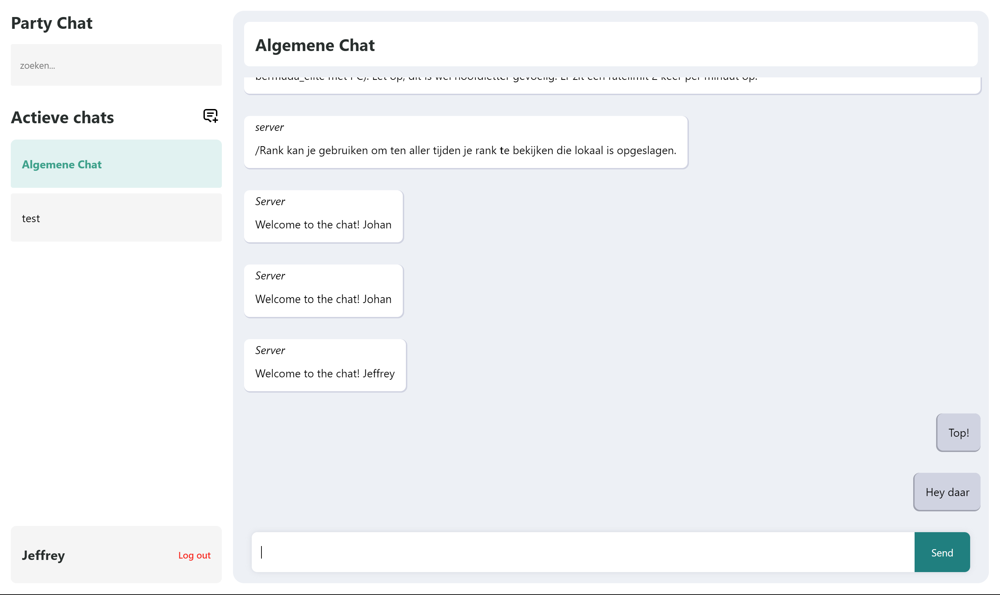
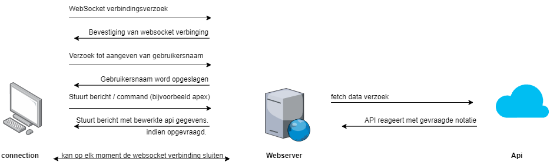
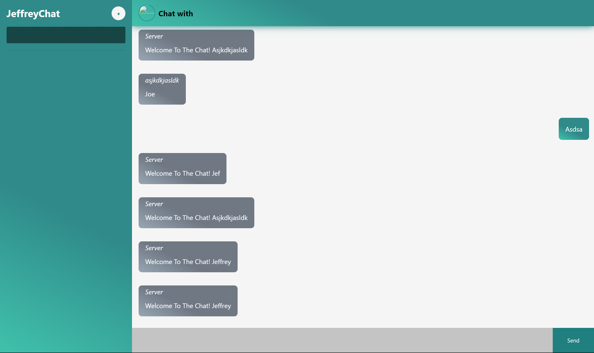
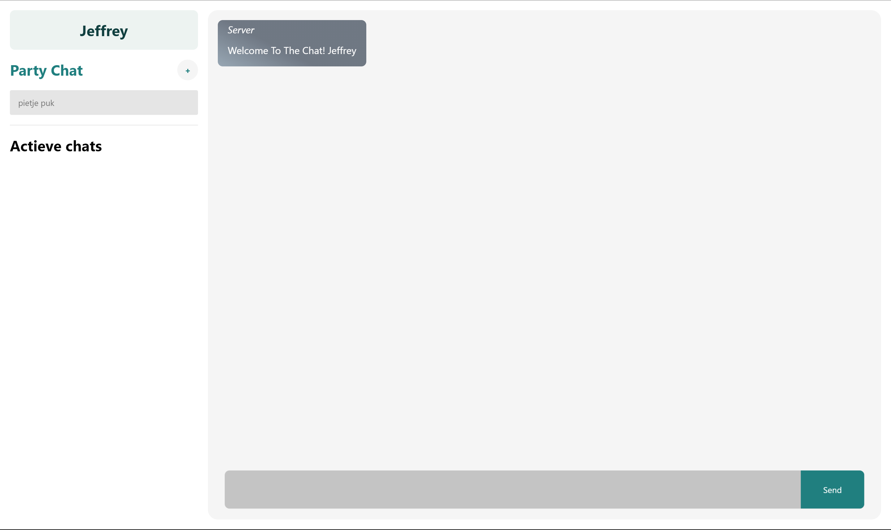
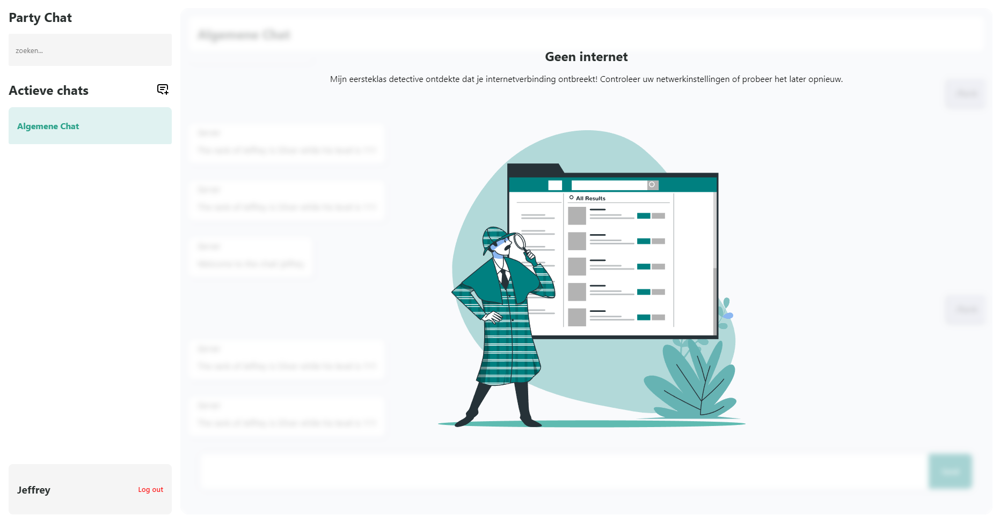

Party Chat
============
[](https://github.com/IgorAntun/node-chat/issues) [](https://github.com/IgorAntun/node-chat) [](https://igorantun.com/chat) 

View the project live here at: [barebone chat app](https://barebone-chat-app-production.up.railway.app/)

This is a node.js chat application powered by node.js, socket.io and Express that provides the main functions you'd expect from a chat, such as emojis and group conversations for now. You're able to fetch Apex Legends data with the /apex command. and more.

I haven't been able to work out a real use-case with this. even though I had set up a MOSCOW I had a lot of struggles with understanding socket.io. luckily I'm proud to say that I do understand it quite a lot more than I did before after struggling a lot.



---

## Features
- Fluid responsive Design
- Emoji support
- fetch data from your apex legends account
- Other awesome features yet to be implemented

Currently there are 5 commands available
1. /help 
   to see the available commands with more information
2. /online 
   to see who is online.
3. /apex  `<username> <platform>`
   with this you can set your userdata.
4. /rank
   can be used to view your current rank

---

## Setup
Clone this repo with `gh repo clone GekkeBoyJeff/barebone-chat-app`  and run `npm install` to install all the dependencies.

You'll need an Apex Legends API key from [https://apexlegendsapi.com/#introduction](apex legends api)
Put that key in your .env file under apexKey

After that you can start the server by running `npm start` in the console

--- 

## Data life cycle

1.  **User (Computer) Initiates WebSocket Connection**: The user opens the application on their computer, and the application initiates a WebSocket connection request with the web server.
    
2.  **Web Server Confirms WebSocket Connection**: Upon receiving the user's connection request, the web server processes the request and sends a confirmation of the connection back to the user.
    
3.  **User Sends Message via WebSocket**: The user can now send messages to the server through the WebSocket connection. These messages can include commands to retrieve data via an API or, for example, to increase or decrease the level of a specific user.
    
4.  **Web Server Executes Script**: When the web server receives a message from the user, it analyzes the message to determine the action to be taken. If the message contains an instruction to increase or decrease a user's level, the server executes the relevant script, such as `levelUp.js` or `levelDown.js`. The script looks up the user's name in a local 'data.json' file, modifies the user's level, and saves the updated data in the file.
    
5.  **Web Server Prepares Message**: After executing the script, the web server prepares a message to send back to the user. This message may contain the new status of the user if the level was successfully increased or decreased, or it may include an error message if the user was not found in the 'data.json' file.
    
6.  **Web Server Sends Message via WebSocket**: The server sends the prepared message to the user through the WebSocket connection. The user receives the message, and the application can process the received information to update the user interface accordingly.
    
7.  **Closing the WebSocket Connection**: Finally, at any point during this communication, both the user and the server can choose to close the WebSocket connection. This can happen when the user closes the application or when the server detects a specific condition that requires closing the connection.

---

## API Data model


As you can see, the data from the API is quite complex, and not all data is accurate. Unfortunately, this is often the case when APIs are unofficial or not properly maintained.

--- 

## Moscow

Sadly I did not really have much feedback on what I could make out of this project. However I was able to think out what I wanted to be able to do. With the time and knowledge available I sadly was not able to do the stuff I wanted to do from my could do list. However, I'm still proud of what I was able to do.

### Should do
1. Save the chats externally
2. Fetch data
3. Show data
4. Manipulate data
5. Nice UI

### Could do
1. Make the commands fancy and easier to put in.
2. Dark theme
3. Add images.

### Would do
1. login system
2. encryption

### Won't do
1. Add multiple game fetch support
2. Add a game

--- 

### Proud of

### The design

I changed the design quite a few times. I wanted it to look good but finding the right approach to making something look nice was hard. after a lot of struggling with the style I was able to transform my layout and UI.

#### V1.


I had the general layout already in place but I wasn't sure on how to make it look more modern.

#### V2.


After a bit of changing the style I came out with this. I did like the layout but it still wasn't quite right. just like the colors. They were all over the place and made it look messy.

#### V3 (Final)


This is my most recent design. I evened the colors a lot more and chose what was important and what was not. I'm quite happy with the design change. And ofcourse it is mobile friendly aswell. but why show it here if you can see it for yourself at [Modern ES6 Node.js Chat (railway.app)](https://barebone-chat-app-production.up.railway.app/)

#### Offline state

It does look cool, doesn't it? 😀

### Saving the data to JSON format

Even though it does not sound like much but I had a lot struggles with getting all the messages for each room in a json file and loading these in.

Like saving the messages users sent wasn't that hard but the messages from the server keps going wrong. every time I refreshed the page they also simply dissapeared. 

The solution to this was actually because my code was pretty messy and I didn't understand it all well enough yet. (following guides aint always the best choice to make something work). I'll make things like these from scratch from now on so I'll understand every bit of my code before spending countless of hours debugging over something stupid like:

not knowing the difference between:

```JS
io.to(room).emit('message', { user: 'Server', text: welcomeText });
```

```js
io.emit('message', {user: 'server', text: welcomeText });
```

--- 

Not being able to make usable commands on a large scale. Making arguments work really came in handy because I always wanted to include arguments in my commands to make them more usable.
```JS
if (message.text.trim().startsWith('/')) { // Als het bericht begint met een '/', verwerk het als een commando
    const commandText = message.text.trim().slice(1); // Haal het gedeelte na '/' op (commando en argumenten)
    const [command, ...args] = commandText.split(' '); // Split het gedeelte op in commando en argumenten

    const commandPath = path.join(path.dirname(fileURLToPath(import.meta.url)), '../commands', `${command}.js`); // Bepaal het pad naar het bestand met het commando

    try {
      const commandModule = await import(`file://${commandPath}`); // Importeer het commando

      if (typeof commandModule.default === 'function') {
        // Voer het commando uit en geef de huidige socket en usersOnline mee
        commandModule.default(args.join(' '), socket, usersOnline, currentRoom, rooms, saveChatHistory);
      } else {
        console.error(`Invalid command module: ${command}`);
      }
    } catch (err) {
      // Als het bestand niet bestaat, doe niets
      if (err.code !== 'ENOENT') {
        console.error(err);
      }
    }
  }
});
```

--- 

I'm honestly really happy with this.
